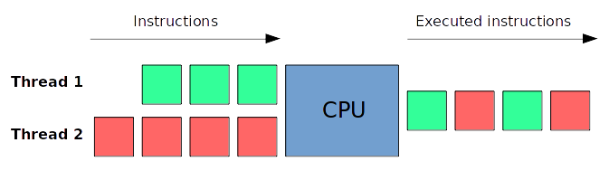
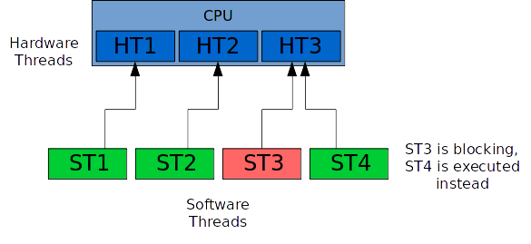

# cpp-concurrency

Basic concurrency code snippets in C++.

## Compilation

```
mkdir build && cd build/
cmake ..
make
```

## Execution

```
./bin/cpp-concurrency
```

## CMake

The current CMake script supports CMake 2.8 and higher.

```cmake
cmake_minimum_required(VERSION 2.8)
```

Set the name of the project.

```cmake
project(cpp-concurrency)
```

Find the `Threads` package.
This is the `module` mode of CMake to find a package:
if the `findThreads.cmake` file is found, its content is executed by CMake;
the `.cmake` file usually contains the whole procedure to find and use external libraries
into the current project. They provide dependency information for the target.
They also perform all the preliminary checks indicating the library is correctly
installed on the current system and can be used as well.

```cmake
find_package(Threads)
```

Set the output path of the generated binary.

```cmake
set(CMAKE_RUNTIME_OUTPUT_DIRECTORY ../bin)
```

The generated executable is not optimized for debug.

```cmake
set(CMAKE_BUILD_TYPE Release)
```

We compile using C++14, and we display all the warnings.

```cmake
add_compile_options(-std=c++14 -Wall)
```

Create a set of all the sources files.

```cmake
file(
    GLOB
    sources
    src/*
)
```

Integrate the includes files directory.

```cmake
include_directories(includes)
```

Specify the executable name after compilation.

```cmake
add_executable(
    cpp-concurrency
    ${sources}
)
```

The libraries of the `Threads` package are used during the linking process.
The command below adds `-lthread ...` to the compilation command.

```cmake
target_link_libraries(cpp-concurrency ${CMAKE_THREAD_LIBS_INIT})
```

## Concurrency theory

### Threads

Threads are independent sequences of execution.
Threads are started by processes and run into the same memory space.
Processes run in different memory spaces.

The "memory space" management/organization depends of the OS implementation,
but it's usually a space owned by one process (and many threads if the process is multithreaded).



#### Hardware threads vs Software threads

Hardware threads are a feature of the processor. This is the entity that really makes calculations.
The amount of hardware threads is fixed and depends of the CPU.

Software threads are started by processes/OS, and managed by the OS.
They are sent to the hardware threads for execution.
Usually, if a software thread is blocking (waiting for an IO),
a hardware thread is able to take another software thread and executes it.



#### Basic concurrency with threads

The following code (in `simple_thread`) starts two threads,
and waits for each one to finish.

```cpp
std::thread firstThread(procedureToRun);

std::thread secondThread(procedureToRun);

firstThread.join();
secondThread.join();
```

### Tasks

#### Simple tasks usage

An example of this feature can be found into `simple_task`.

A task is a function passed to `std::async`.
By using this function, a thread "might" be created to execute the passed function.
The standard library analyzes by itself if the creation of a new thread
is really necessary for the method (according to the processor hardware threads,
the CPU caches, the CPU specificities...). In some cases, the `std::async` method
will simply execute the given function in the same thread that asks for the task
result (`get` function).

```cpp
std::future<int> task = std::async(asynchronousFunction);

/* a lot of code */

auto result = task.get();
```

#### Oversubscription problem

This is a very common multi-threading problem.
This problem occures when the amount of available hardware threads
is lesser than the amount of non-blocking software threads,
ready to be executed.

The operation system allows each software thread to be executed
for a given time. When the time is over, another software thread
is executed by a hardware thread.

Every software switch is a `context switch` (the CPU hardware thread
must be refreshed in order to execute the new given thread).

`std::async` is a solution to this problem, as it may execute
the given function without any new thread creation.
